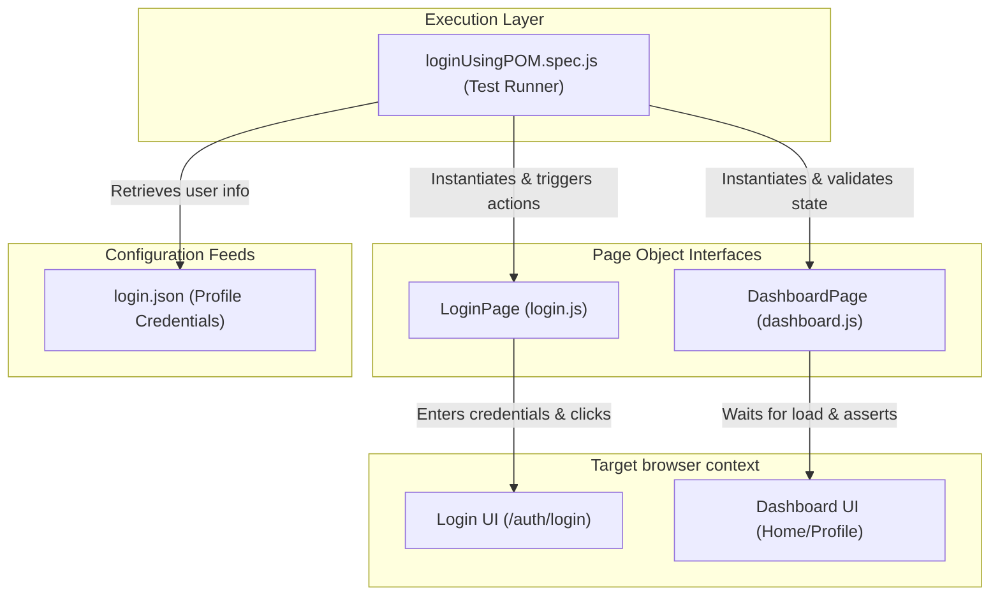

# Learning Playwright (Advanced E2E Sandbox)

A comprehensive, production-grade E2E automation repository designed to master complex browser testing and web automation using **Playwright** and **JavaScript**. This sandbox implements robust testing patterns including the Page Object Model (POM), data-driven testing (DDT) via external JSON files, custom keyboard interactions, dialog interceptors, iframe handling, multi-tab orchestration, Allure Reporting, and GitHub Actions continuous integration pipelines.

---

## 🛠️ Technology Stack & Dependencies


---

## 🚀 Key Automation Architectures Coverages

*   **🏛️ Page Object Model (POM)**: Segregates DOM selectors and action scripts into standalone classes (`LoginPage.js`, `DashboardPage.js`), resulting in elegant, maintainable, and reusable testing modules.
*   **📊 Dynamic Data-Driven Testing (DDT)**: Parses external datasets (`usersLogin.json`) to programmatically run test matrices over different user profile configurations in parallel.
*   **🔌 Complete DOM Locator APIs**: Exercises advanced element actions including dynamic dropdown selection, autocomplete list parsing, file uploads, and specific key-press combinations.
*   **🛡️ Dialog Alert Interceptors**: Injects callback listeners onto Playwright's `dialog` event listener to dynamically parse native warning prompts (`alert`, `confirm`, `prompt`) and inject mock responses.
*   **🔗 Iframe & Window Tab Switcher**: Focuses and navigates elements embedded inside custom `iFrames` and cleanly intercepts new browser windows or popup tab processes.
*   **⚙️ GitHub Actions Automation**: Integrates a complete CI pipeline (`playwright.yml`) to automatically launch headless test suites on push/pull request triggers.
*   **📊 HTML & Allure Reporting Matrix**: Integrates Playwright's native HTML reporters alongside deep diagnostic Allure dashboards.

---

## 📐 Page Object Model (POM) Automation Architecture

This diagram details the operational flow between test specs, page classes, database mock files, and target browsers:



---

## 📂 Repository File Directory

```
Learning-Playwright-from-Youtube/
├── pages/                         # Page Object Model component folders
│   ├── login.js                   # LoginPage selector paths & login methods
│   └── dashboard.js               # DashboardPage logout actions & locator hooks
├── tests/                         # E2E Test Suite files
│   ├── add-delete test...         # Testing dynamic additions and deletes
│   ├── codegen.spec.js            # Auto-generated specs from Playwright codegen
│   ├── dropdown.spec.js           # Multi-select & single select list tests
│   ├── google.spec.js             # Standard search verifications
│   ├── handle-keyboard.spec.js    # Keyboard inputs, hold keys, and shortcuts
│   ├── handle-windows.spec.js     # Window handles and multi-tab switchers
│   ├── handleAlerts.spec.js       # Intercepting native JS alert prompts
│   ├── handleAutoComplete...      # Dropdown autocomplete suggestion loops
│   ├── handleFramesAndIframes.js  # Testing inner iFrame documents
│   ├── login.spec.js              # Standard login regression suite
│   ├── loginByMultipleUsers...    # Multi-user data driven tests from JSON
│   ├── loginUsingPOM.spec.js      # Clean execution of POM specs
│   ├── uploadfile.spec.js         # Testing dynamic file uploads
│   └── verifyErrorMessage.spec.js # Asserting error messages on invalid fields
├── workflows/
│   └── playwright.yml             # GitHub Actions CI trigger pipeline config
├── login.json                     # Primary test credentials configuration
├── usersLogin.json                # User datasets for DDT executions
├── playwright.config.js           # Playwright test config rules
└── package.json                   # Module scripts, dependencies & allure settings
```

---

## 📝 Key Source Code Showcases

### 1. Robust Page Object Interface ([login.js](file:///d:/for%20CV/My%20learnings/Learning-Playwright-from-Youtube/pages/login.js))
Abstracts DOM element interactions and validations cleanly:
```javascript
import { expect } from "@playwright/test";

class LoginPage {
  constructor(page) {
    this.page = page;
    this.email = "#email";
    this.password = "#password";
    this.loginButton = "//button[@class='btn w-100 btn-primary']";
    this.header = "//h4[normalize-space()='Dashboard Login']";
  }

  async loginToApplication(email, pass) {
    await this.page.fill(this.email, email);
    await this.page.fill(this.password, pass);
    await this.page.click(this.loginButton);
  }

  async verifingToLogout() {
    await expect(this.page.locator(this.header)).toBeVisible();
  }
}

module.exports = LoginPage;
```

### 2. Multi-User Regression Loop ([loginByMultipleUsersFromJSON.spec.js](file:///d:/for%20CV/My%20learnings/Learning-Playwright-from-Youtube/tests/loginByMultipleUsersFromJSON.spec.js))
Iterates over dynamic profile credentials arrays to trigger dynamic test execution:
```javascript
import { test, expect } from "@playwright/test";
const loginData = JSON.parse(JSON.stringify(require("../usersLogin.json")));

test.describe("Data driven login test", () => {
  for (const data of loginData) {
    test.describe(`Login with user ${data.id}`, () => {
      test("Login test", async ({ page }) => {
        test.setTimeout(60000);
        await page.goto("http://localhost:8000/auth/login");
        await page.getByRole("textbox", { name: "Email address" }).fill(data.email);
        await page.getByRole("textbox", { name: "Password" }).fill(data.password);
        await page.getByRole("button", { name: "Login" }).click();

        await expect(page).toHaveURL("http://localhost:8000/");
        await page.waitForLoadState("networkidle");
      });
    });
  }
});
```

### 3. Native Modal Dialog Handler ([handleAlerts.spec.js](file:///d:/for%20CV/My%20learnings/Learning-Playwright-from-Youtube/tests/handleAlerts.spec.js))
Configures runtime prompt hooks to verify message context and confirm options programmatically:
```javascript
test("Handling Javascript Alert Modal", async ({ page }) => {
  await page.goto("https://the-internet.herokuapp.com/javascript_alerts");

  // Injects prompt hook
  page.on('dialog', async dialog => {
    expect(dialog.message()).toEqual("I am a JS Alert");
    await dialog.accept();
  });

  await page.click("button[onclick='jsAlert()']");
  await expect(page.locator("#result")).toHaveText("You successfully clicked an alert");
});
```

---

## 🚀 Setup & Execution Guide

### Prerequisites
Make sure the following are installed:
*   **Node.js** version 18.0 or higher
*   **npm** (Node package manager)

### Installation & Run Steps
1.  **Clone the Repository**:
    ```bash
    git clone https://github.com/Imtiaz-Ali17314/Learning-Playwright-from-Youtube
    cd Learning-Playwright-from-Youtube
    ```
2.  **Install Node Dependencies**:
    ```bash
    npm install
    ```
3.  **Run All Tests (Headless)**:
    ```bash
    npx playwright test
    ```
4.  **Run specific test file**:
    ```bash
    npx playwright test tests/loginUsingPOM.spec.js
    ```
5.  **Run with Interactive UI Dashboard**:
    ```bash
    npx playwright test --ui
    ```

### Generating Visual Reports
*   **Playwright Built-in Report**:
    ```bash
    npx playwright show-report
    ```
*   **Allure Advanced Dashboard Report**:
    ```bash
    npx allure generate allure-results --clean
    npx allure open
    ```
